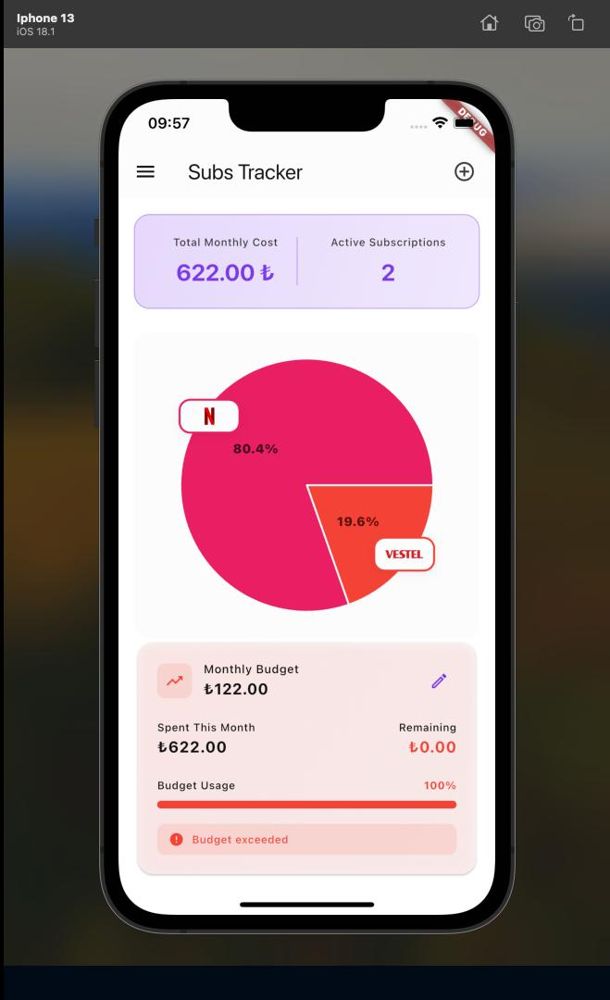
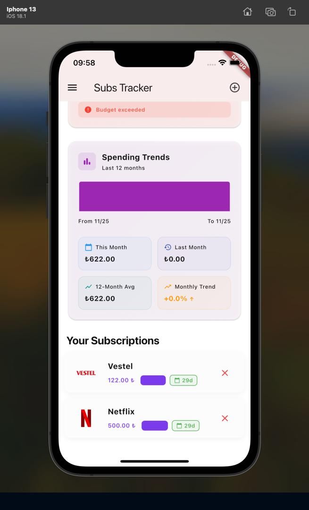

# subs_tracker

Project for manage your monthly price payment

## 📱 App Preview

  <table>
    <tr>
      <td align="center" width="50%">
        <b>Home Screen</b>
         
        
         
        
<i>Dashboard overview with budget tracking</i>

      </td>
      <td align="center" width="50%">
        <b>Subscriptions</b>
         
        
         
        
<i>Manage all your subscriptions</i>

      </td>
    </tr>
  </table>

**Subs Tracker** helps you manage and monitor your monthly subscription payments with an intuitive dashboard showing spending trends and budget tracking.
